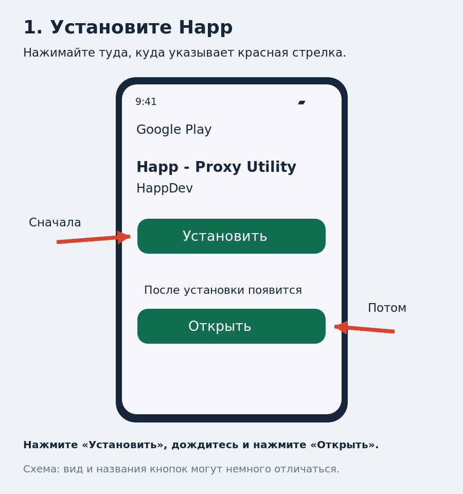
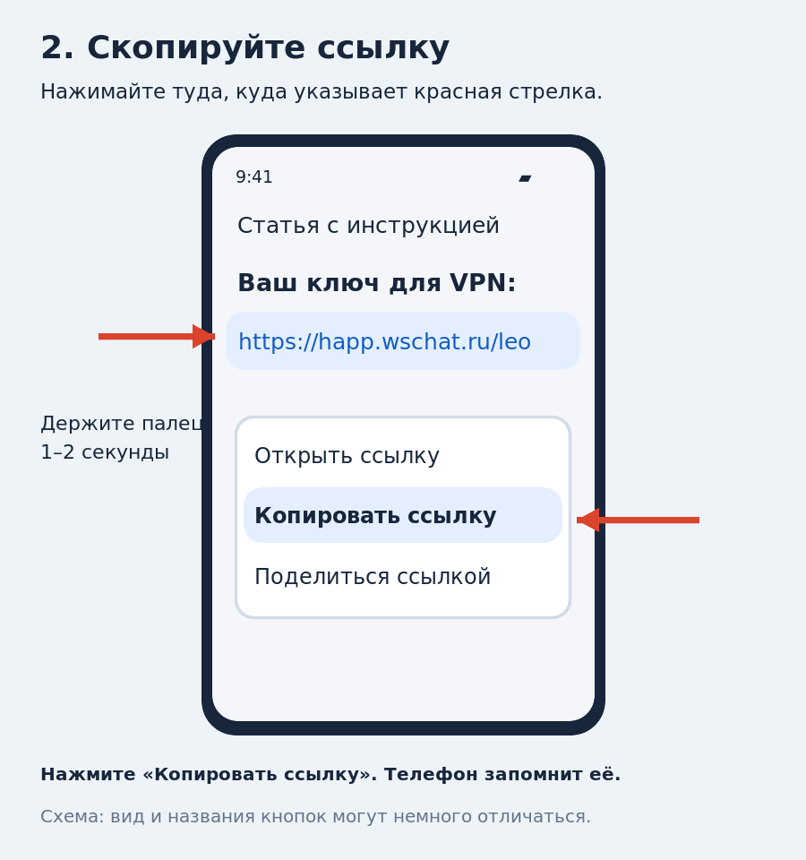
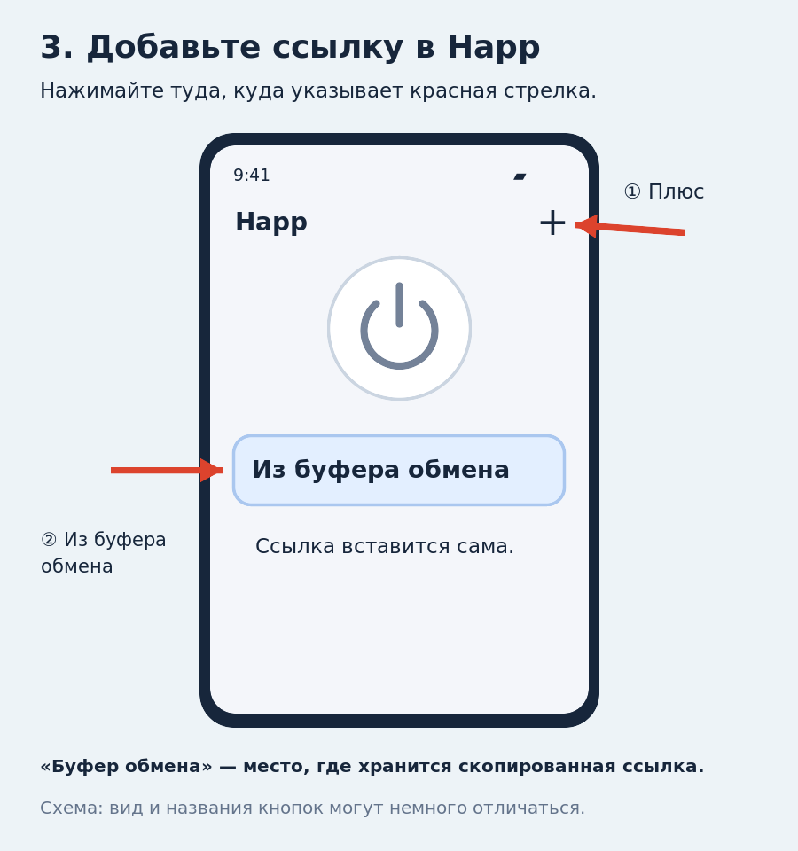
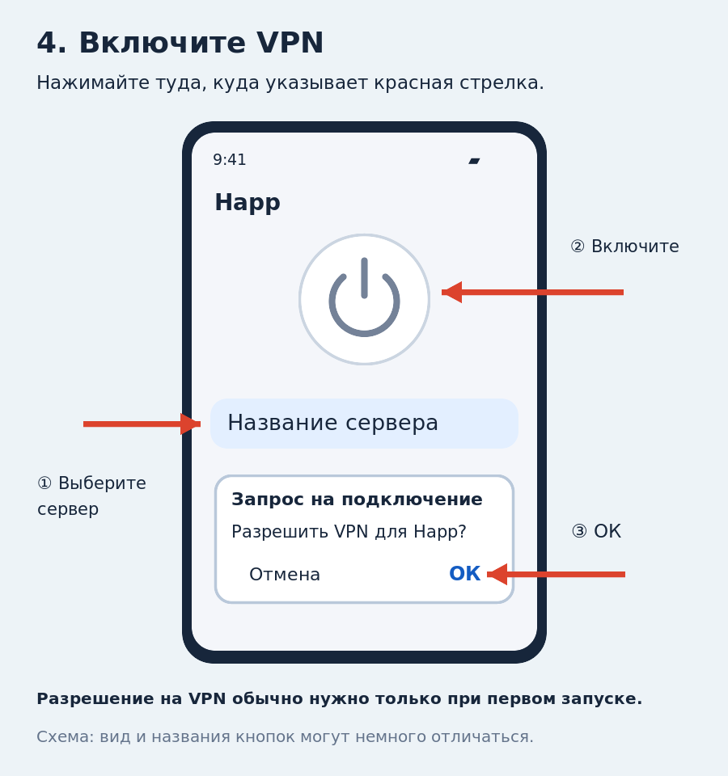

# Как установить и включить VPN на Android

Понадобятся телефон с интернетом, приложение **Happ** и ссылка для подключения. Всё делаем на том телефоне, на котором будем пользоваться VPN.

**Настройка нужна только один раз.** Потом достаточно открыть Happ и нажать кнопку включения.

На картинках показаны упрощённые схемы. Цвета, расположение и названия кнопок на вашем телефоне могут немного отличаться.

## Шаг 1. Установите приложение Happ

1. Нажмите на эту ссылку: [Открыть Happ в Google Play](https://play.google.com/store/apps/details?id=com.happproxy).
2. Откроется страница **Happ - Proxy Utility**. Под названием приложения указан разработчик **HappDev**.
3. Нажмите **«Установить»**. Подождите, пока телефон скачает и установит приложение.
4. Когда появится кнопка **«Открыть»**, нажмите её. Если она была видна сразу, Happ уже установлен.

**Теперь вернитесь к этой инструкции, чтобы скопировать ссылку.** Если внизу экрана есть кнопка-квадратик или три полоски, нажмите её: появятся карточки открытых приложений. Выберите карточку с этой статьёй. Если кнопок внизу нет, проведите пальцем от самого нижнего края экрана вверх и ненадолго задержите палец — появятся те же карточки.

## Шаг 2. Скопируйте ссылку для VPN

Вот ваш ключ для подключения — вся строка ниже:

[https://happ.wschat.ru/leo](https://happ.wschat.ru/leo)

1. Поставьте палец **на синюю ссылку выше** и держите примерно **1–2 секунды**, пока не появится меню. Затем отпустите палец.
2. В меню нажмите **«Копировать ссылку»**. На некоторых телефонах это называется **«Копировать адрес ссылки»**.
3. Готово: телефон запомнил ссылку. Записывать её на бумаге и перепечатывать не нужно.

**Если вместо меню открылась страница:** вернитесь назад к статье и попробуйте ещё раз. Нужно задержать палец на ссылке, а не быстро коснуться её.

## Шаг 3. Вставьте ссылку в Happ

1. Снова откройте **Happ** через карточки приложений. Либо найдите значок Happ на телефоне и нажмите его.
2. Нажмите **плюс «+» в правом верхнем углу**.
3. Выберите пункт со словами **«Из буфера»** или **«Из буфера обмена»**. Название может быть длиннее, например «Добавить из буфера обмена». Если кнопка «Из буфера» уже видна на главном экране, можно нажать её сразу.
4. Подождите несколько секунд. Под большой круглой кнопкой должен появиться список серверов — одна или несколько строк с названиями.

**Что такое «буфер обмена»?** Это временная память телефона для скопированного текста. Вы нажали «Копировать ссылку» — телефон её запомнил. Нажимаете «Из буфера» в Happ — приложение забирает эту ссылку. Вручную печатать её не нужно.

## Шаг 4. Включите VPN

1. Если появились несколько серверов, нажмите **на название одного из них**. Если сервер один и уже выделен, переходите дальше.
2. Нажмите **большую круглую кнопку включения** в верхней части экрана Happ.
3. При первом подключении Android обычно показывает окно **«Запрос на подключение»** или похожий запрос на создание VPN-соединения. В запросе для Happ нажмите **«ОК»** или **«Разрешить»**. Это разрешает приложению подключать VPN.
4. Подождите несколько секунд. В Happ должен появиться признак активного подключения: изменится кнопка, появится статус подключения или начнёт идти время соединения. Android также может показать значок ключа или надпись VPN вверху экрана.

Откройте нужный сайт или приложение и проверьте, что оно работает. Happ можно свернуть: держать его на экране всё время не нужно.

## Как пользоваться потом

**Включить VPN:** откройте Happ → нажмите большую круглую кнопку → дождитесь подключения.

**Выключить VPN:** откройте Happ → нажмите ту же кнопку ещё раз.

Повторно устанавливать приложение и вставлять ссылку каждый раз не нужно.

## Если что-то не получилось

**Появилось сообщение «Буфер обмена пуст» или ошибка ссылки.** Вернитесь к шагу 2, ещё раз скопируйте именно ссылку и сразу добавьте её в Happ. Между этими действиями ничего другого не копируйте.

**Список серверов не появился.** Проверьте, работает ли обычный интернет: Wi-Fi или мобильная связь. Повторите добавление ссылки. Если ошибка остаётся, передайте её текст тому, кто выдал ключ.

**VPN включён, но нужный сайт не открывается.** Выключите VPN, выберите другой сервер из списка, если он есть, и снова включите. Затем заново откройте сайт.

**Google Play не открывается или приложение недоступно.** Есть запасной способ установки:

1. Нажмите [Скачать Happ.apk от разработчика](https://github.com/Happ-proxy/happ-android/releases/latest/download/Happ.apk). APK — это установочный файл приложения.
2. Дождитесь окончания скачивания и нажмите «Открыть» в сообщении браузера. Если сообщение исчезло, откройте в браузере меню «⋮» → «Скачанные файлы» или «Загрузки» и выберите **Happ.apk**.
3. Если Android сообщает, что установка из этого источника запрещена, нажмите «Настройки» и включите «Разрешить установку из этого источника» для браузера, через который скачали файл. Вернитесь назад к установке Happ.
4. Нажмите «Установить», затем «Открыть». После установки разрешение на установку из этого источника можно снова выключить.
5. Продолжайте с шага 2 этой инструкции.

Ссылка на Google Play и запасной файл APK указаны на [официальном сайте Happ](https://www.happ.su/main/ru). Способ добавления ссылки описан в [справке Happ](https://www.happ.su/main/ru/faq/adding-configuration-subscription).
